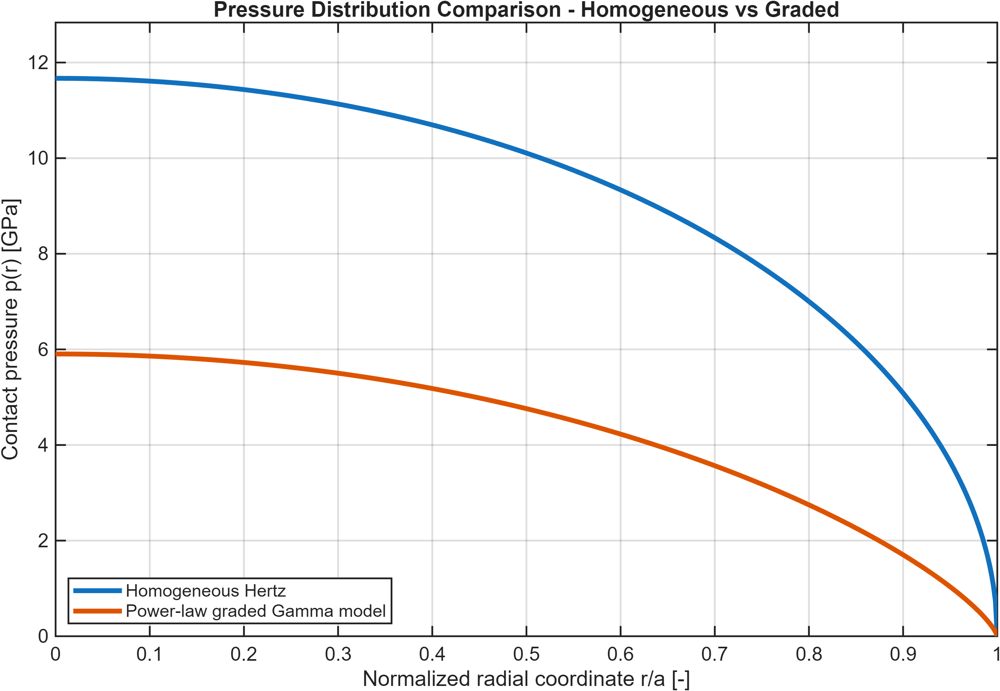
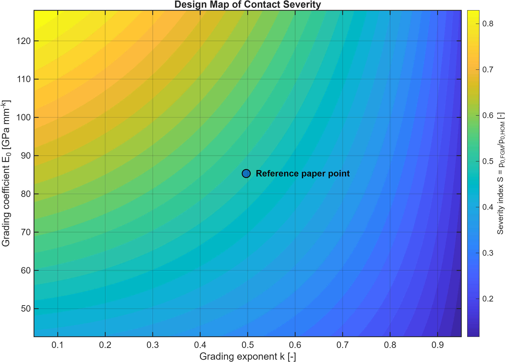
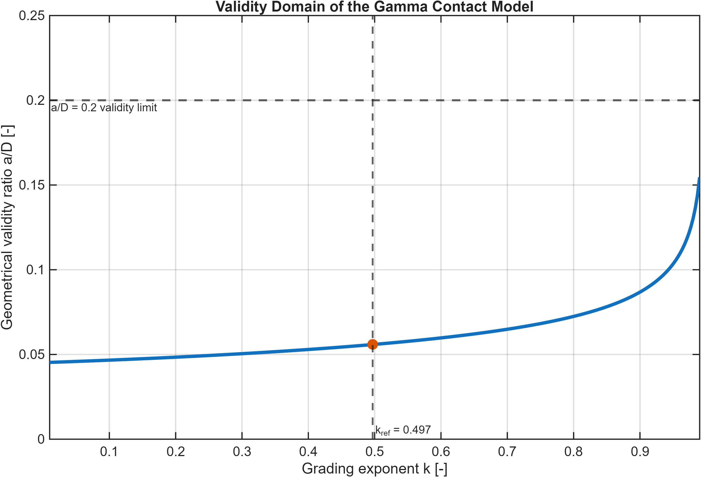

# Elastic Modulus Grading for Contact Mitigation in Functionally Graded Ceramics


---

## Overview

Brittle ceramics are widely used in engineering and biomedical applications thanks to their high stiffness, wear resistance, and chemical stability. However, their limited fracture toughness makes them vulnerable to surface damage under concentrated contact loading.

When a spherical indenter presses against a ceramic surface, localized tensile stresses may develop near the contact boundary. If these stresses exceed the material resistance, Hertzian cone cracks can nucleate and propagate, eventually compromising structural integrity.

One strategy to mitigate this failure mechanism is the use of **Functionally Graded Materials (FGMs)**, where the elastic modulus varies continuously with depth. A compliant surface combined with a progressively stiffer substrate can redistribute contact stresses, enlarge the contact area, and reduce peak pressure.

This project investigates how elastic grading influences contact mechanics using an analytical framework based on the **Gamma contact model** proposed by Jitcharoen et al. The objective is to quantify the effects of grading on contact radius, indentation depth, pressure distribution, contact severity, and the tendency toward Hertzian cone-crack initiation.

---

## Engineering Motivation

The physical idea behind the project can be summarized as:

```text
Homogeneous ceramic
↓
Localized contact stresses
↓
High tensile stresses
↓
Cone crack initiation

Functionally graded ceramic
↓
Larger contact area
↓
Stress redistribution
↓
Lower peak pressure
↓
Reduced crack propensity
```

Rather than increasing fracture toughness directly, elastic grading acts as a passive stress-management strategy.

---

## Research Question

The central question addressed in this project is:

> How does elastic modulus grading modify Hertzian contact mechanics and influence the conditions associated with cone-crack initiation in brittle ceramics?

More specifically, the study investigates:

- the influence of the grading exponent `k`;
- the influence of the grading coefficient `E0`;
- the influence of the applied load `P`;
- the validity limits of the analytical model;
- the relationship between pressure reduction and crack suppression.

---

## Physical Background

### Classical Hertzian Contact

For a homogeneous elastic half-space loaded by a spherical indenter, Hertz theory predicts:

- contact radius `a`;
- indentation depth `h`;
- pressure distribution `p(r)`;
- maximum pressure `p0`.

The homogeneous Hertzian contact radius is obtained from:

$$
a^3 = \frac{3PR}{4E^*}
$$

The indentation depth is:

$$
h = \frac{a^2}{R}
$$

The maximum contact pressure is:

$$
p_0 = \frac{3P}{2\pi a^2}
$$

Although Hertz theory provides an elegant analytical solution, it assumes homogeneous material properties and therefore cannot capture the effects of elastic grading.

---

### Functionally Graded Materials

In a Functionally Graded Material, the elastic modulus varies continuously with depth.

The real material profile considered in the reference paper is:

$$
E(z) = E_{surface} + E_0 z^k
$$

For the analytical Gamma formulation, the simplified power-law profile is used:

$$
E(z) = E_0 z^k
$$

where:

- `E(z)` = elastic modulus at depth `z`;
- `E_surface` = surface elastic modulus;
- `E0` = grading coefficient;
- `k` = grading exponent.

The grading exponent controls the shape of the stiffness profile:

- small `k` → weak grading;
- large `k` → stronger grading.

The grading coefficient controls the overall stiffness level of the graded medium.

---

## Reference Analytical Model

This project is based on the analytical formulation proposed by:

**Jitcharoen et al. — Hertzian-Crack Suppression in Ceramics with Elastic-Modulus-Graded Surfaces**

The model introduces a Gamma-function-based formulation for axisymmetric contact between a spherical indenter and a power-law graded elastic half-space.

Unlike classical Hertz theory, the contact radius is the primary unknown of the problem. Once the contact radius is obtained, all remaining quantities can be computed analytically:

- indentation depth;
- pressure distribution;
- maximum pressure.

The Gamma-based contact model relates applied load and contact radius through a power-law expression of the form:

$$
a^{k+3} = F(P, D, E_0, k, \nu, \Gamma)
$$

where:

- `P` = applied load;
- `D` = indenter diameter;
- `E0` = grading coefficient;
- `k` = grading exponent;
- `ν` = Poisson's ratio;
- `Γ` = Gamma function.

The analytical formulation naturally reduces to the classical Hertz solution when the grading effect vanishes.

---

## Methodology

The project follows a fully analytical and reproducible workflow implemented in MATLAB.

### Step 1 — Classical Hertz Reference Solution

Reference contact quantities are computed for a homogeneous material:

- contact radius;
- indentation depth;
- maximum pressure.

Script:

```text
main_01_hertz_classic.m
```

---

### Step 2 — Elastic Profile Definition

The real elastic grading profile is generated and visualized.

Script:

```text
main_02_elastic_profile.m
```

---

### Step 3 — Gamma Contact Solution

The analytical Gamma formulation is solved numerically to obtain:

- contact radius;
- indentation depth;
- pressure distribution.

Script:

```text
main_03_graded_gamma_model.m
```

---

### Step 4 — Homogeneous vs Graded Comparison

Direct comparison between Hertzian and graded solutions.

Script:

```text
main_04_homogeneous_vs_graded.m
```

---

### Step 5 — Parametric Study on Grading Exponent

Investigation of the influence of `k` on contact mechanics.

Scripts:

```text
main_05_parametric_k.m
main_06_pressure_profiles_vs_k.m
```

---

### Step 6 — Validity-Domain Assessment

Verification of the analytical validity condition:

$$
\frac{a}{D} < 0.2
$$

Script:

```text
main_07_validity_domain_k.m
```

---

### Step 7 — Parametric Study on Grading Coefficient

Investigation of the influence of `E0`.

Script:

```text
main_08_parametric_E0.m
```

---

### Step 8 — Parametric Study on Applied Load

Investigation of load dependence.

Script:

```text
main_09_parametric_load.m
```

---

### Step 9 — Design-Oriented Severity Maps

Generation of design maps in the `(k, E0)` parameter space.

Script:

```text
main_10_k_E0_severity_map.m
```

---

### Step 10 — Crack-Suppression Interpretation

Introduction of a simplified indicator connecting pressure mitigation and crack suppression.

Script:

```text
main_11_crack_suppression_indicator.m
```

---

## Key Quantities

### Contact Severity Index

A dimensionless severity metric is defined as:

$$
S_p = \frac{p_{0,FGM}}{p_{0,HOM}}
$$

where:

- `Sp` = contact severity index;
- `p0,FGM` = maximum contact pressure in the graded material;
- `p0,HOM` = maximum contact pressure in the homogeneous Hertzian reference material.

Interpretation:

- `Sp = 1` → no benefit;
- `Sp < 1` → pressure reduction;
- lower `Sp` → stronger contact mitigation.

---

### Crack-Suppression Indicator

A simplified crack-suppression indicator is defined as:

$$
I_{cc} = 1 - S_p
$$

Interpretation:

- `Icc = 0` → no improvement;
- larger `Icc` → stronger pressure mitigation;
- larger `Icc` → lower expected tendency for cone-crack initiation.

This indicator does **not** represent a fracture-mechanics criterion. It is a qualitative engineering measure based only on pressure reduction.

---

## Main Results

### Pressure Redistribution

The graded material exhibits a larger contact radius and a lower maximum contact pressure compared with the homogeneous Hertzian solution.



The model predicts an approximately **50% reduction in peak contact pressure** for the reference graded configuration.

---

### Effect of Grading Exponent `k`

Increasing `k` produces:

- larger contact radius;
- larger indentation depth;
- lower maximum pressure;
- lower contact severity;
- stronger crack-suppression indicator.

The grading exponent therefore acts as a design parameter controlling the intensity of stress redistribution.

---

### Effect of Grading Coefficient `E0`

Increasing `E0` produces:

- smaller contact radius;
- lower indentation depth;
- higher maximum pressure;
- reduced mitigation effect.

A softer graded surface promotes pressure redistribution more effectively.

---

### Effect of Applied Load

As the load increases:

- contact radius increases;
- indentation depth increases;
- maximum pressure increases.

However, the graded solution remains consistently less severe than the homogeneous Hertzian solution over the entire investigated load range.

---

## Design-Oriented Severity Map

A major outcome of the project is the generation of design maps in the `(k, E0)` parameter space.

The severity map shows how the grading exponent and grading coefficient jointly influence the maximum contact pressure relative to the homogeneous Hertzian reference.



The most favorable regions correspond to:

- larger `k`;
- lower `E0`;
- lower contact severity;
- stronger pressure redistribution.

---

## Validity Domain

The Gamma formulation relies on the small-contact assumption:

$$
\frac{a}{D} < 0.2
$$

where:

- `a` = contact radius;
- `D` = indenter diameter.

The investigated configurations remain below this limit.



Therefore, the main conclusions are obtained within the validity range of the analytical model.

---

## Engineering Interpretation

The physical mechanism observed throughout the study can be summarized as:

```text
Compliant surface
↓
Larger contact radius
↓
Pressure redistribution
↓
Lower contact severity
↓
Lower tensile stresses near the contact edge
↓
Reduced cone-crack propensity
```

Elastic grading does not eliminate contact stresses. Instead, it redistributes them over a larger contact area, reducing local stress concentrations that are typically responsible for Hertzian cone-crack initiation.

---

## Repository Structure

```text
fgm-hertzian-contact-model
│
├── 00_docs/
│   └── README.md
│
├── 01_matlab/
│   ├── functions/
│   ├── README.md
│   ├── main_01_hertz_classic.m
│   ├── main_02_elastic_profile.m
│   ├── main_03_graded_gamma_model.m
│   ├── main_04_homogeneous_vs_graded.m
│   ├── main_05_parametric_k.m
│   ├── main_06_pressure_profiles_vs_k.m
│   ├── main_07_validity_domain_k.m
│   ├── main_08_parametric_E0.m
│   ├── main_09_parametric_load.m
│   ├── main_10_k_E0_severity_map.m
│   └── main_11_crack_suppression_indicator.m
│
├── 02_results/
│   ├── data/
│   ├── figures/
│   ├── tables/
│   └── README.md
│
├── 03_presentation/
│   ├── Micromechanics_Tremolada.pdf
│   └── README.md
│
└── README.md
```

---

## Reproducibility

The workflow is organized so that each analysis step corresponds to a numbered MATLAB script.

To reproduce the full project:

1. open MATLAB;
2. add the `01_matlab/functions/` folder to the MATLAB path;
3. run the main scripts in numerical order;
4. inspect generated CSV files and figures in `02_results/`.

All numerical outputs are stored in:

```text
02_results/data/
02_results/tables/
```

All final figures are stored in:

```text
02_results/figures/
```

---

## Presentation

The final course presentation is available here:

```text
03_presentation/Micromechanics_Tremolada.pdf
```

It summarizes the theoretical background, MATLAB implementation, validation, main results, physical interpretation, limitations, and future developments.

---

## Main Conclusions

- Elastic grading significantly modifies Hertzian contact behavior.
- A compliant surface combined with a stiffer substrate increases the contact area.
- Increasing the grading exponent reduces peak contact pressure.
- Pressure reductions of approximately 50% are obtained for the reference configuration.
- Reduced contact severity is associated with a lower propensity for Hertzian cone-crack initiation.
- The investigated configurations remain within the analytical validity domain.
- Functionally graded ceramics represent an effective strategy for passive stress mitigation under concentrated contact loading.

---

## Limitations

The present model does not directly simulate crack nucleation or crack propagation.

The model does not include:

- full subsurface stress-field reconstruction;
- stress intensity factor evaluation;
- energy release rate calculations;
- explicit LEFM crack-initiation criteria;
- residual stresses;
- plastic deformation;
- frictional contact.

Therefore, the crack-suppression interpretation should be considered qualitative and based on pressure redistribution.

---

## Future Developments

Potential extensions include:

- axisymmetric Finite Element Analysis;
- reconstruction of the full subsurface stress field;
- evaluation of tensile stress fields near the contact edge;
- LEFM-based crack-initiation criteria;
- stress intensity factor calculations;
- experimental validation through spherical indentation;
- optimization of grading profiles for contact-damage resistance.

---

## References

J. Jitcharoen, N. P. Padture, A. E. Giannakopoulos, S. Suresh,  
*Hertzian-Crack Suppression in Ceramics with Elastic-Modulus-Graded Surfaces*,  
Journal of the American Ceramic Society, 81(9), 2301–2308, 1998.

---

## Author

**Federico Tremolada**  
M.Sc. Student in Biomechanics and Biomaterials  
Politecnico di Milano  

Micromechanics Course Project
